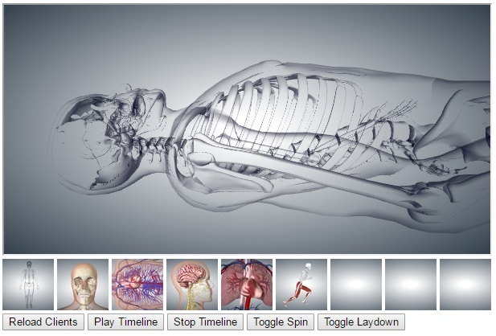
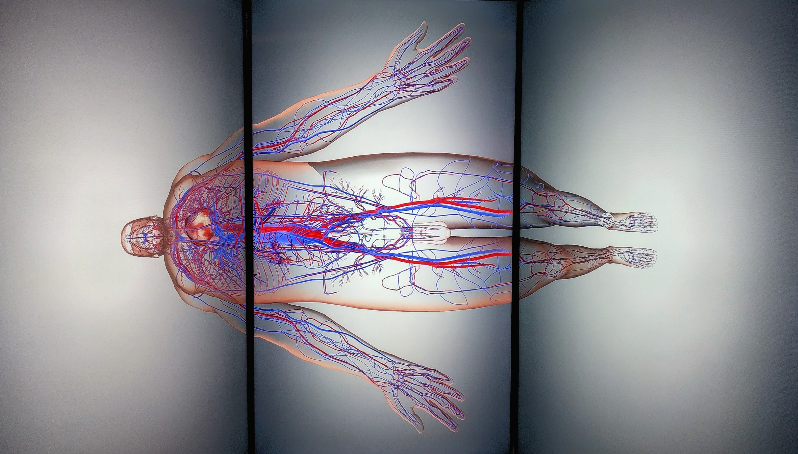

# lg-biodigital

BioDigital on Liquid Galaxy (take 1)

## Start the websocket relayer

In the repo NodeRelay folder is a nodejs-based websocket relayer called ```relay.js```

Run this on lg-head or another place on the same LAN as the nodes.

You may need to change the port and/or fiddle with lg-head firewall. Look in the CONFIG section at the top of relay.js.
I've been running it on ws://10.42.41.1:5555/relay

```
cd NodeRelay
node ./relay.js
```

Some additional node modules will need to be installed, an ```npm install``` should catch most of them.
But there will be a couple which will need a follow-your-nose install.

## Control setup

```config.js``` contains the ws URI that the control.html and client.html apps attempt to connect too.
Check this config file and edit as needed.

On a laptop/desktop on the same LAN as the Galaxy nodes open the control page -

```
http://HOST/PATH/lg-biodigital/control.html
```



## Client setup

In the Galaxy CMS create a Scene which has Web Page Assets for each screen (I call mine L3, L2, L1, C, R1, R2, R3) each running a full screen browser with a URL like -

```
http://HOST/PATH/lg-biodigital/client.html?yaw=67
```

Until the fov can be set, I'd start with a yaw offset of about 67 for each screen. So: +-67, 134 & 201.

You can override the websocket relay address in ```config.js``` with a URL parameter.

``` 
http://HOST/PATH/lg-biodigital/client.html?yaw=67&ws=ws://192.168.0.2:3000/relay
```



## Notes

* Run client Chrome's with "--disable-web-security --user-data-dir=A_FOLDER" to get fov setting to work.

* Biodigital models can take 30-60 seconds to load completely, especially the animated ones.

* Try the 'Play/Stop Animation' buttons on scenes like 'Respiration' and 'Running Man'.

* 'Play Animation' button currently always jumps to the start of the animation cycle.

* 'Toggle Spin' button performs a simple axial rotation.

* 'Toggle Laydown' button alternates between a preconfigured camera pose with Z axis rotate and a typical upright pose. You can't do this from keyboard/mouse control.

* The clients have mouse/keyboard input disbled

* The camera pose string handling is overly complex because I'm experimenting with only sending the changes from last pose. Eventually this should be simplified to a more efficient binary ProtocolBuffer.

-- 
Andrew (Alf) Leahy | [Wonderama Lab](http://wonderama.scem.ws) | [School of Computing, Engineering & Mathematics](https://www.westernsydney.edu.au/scem/school_of_computing_engineering_and_mathematics) | [Western Sydney University](https://www.westernsydney.edu.au/)
