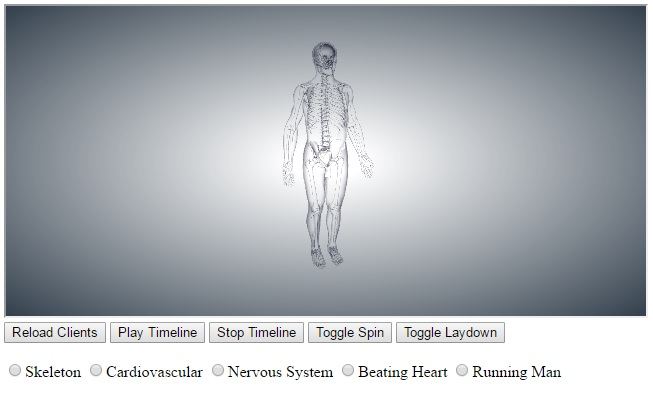

# lg-biodigital

BioDigital on Liquid Galaxy (take 1)

## Start the websocket relayer

In the repo NodeRelay folder is a nodejs-based websocket relayer called ```relay.js```

Run this on lg-head or another place on the same LAN as the nodes.

You may need to change the port and/or fiddle with lg-head firewall. Look in the CONFIG section at the top of relay.js.
I've been running it on ws://10.42.41.1:5555/relay

```
cd NodeRelay
node ./relay.js
```

Some additional node modules will need to be installed, an ```npm install``` should catch most of them.
But there will be a couple which will need a follow-your-nose install.

```config.js``` contains the URI that the application client.html and control.html will attempt to connect too.


## Control setup

On laptop/desktop on the same LAN as the Galaxy nodes open the control page

```
http://HOST/PATH/lg-biodigital/control.html
```



## Client setup

Using the LG CMS create a Scene which has each screen (L3, L2, L1, C, R1, R2, R3) running a full screen browser with this URL like this. Until the fov can be set, I'd start with a yaw offset of about 67 for each screen. So: +-67, 134, 201.

```
http://HOST/PATH/lg-biodigital/client.html?yaw=67
```

You can override the ws relay address in ```config.js``` with a URL parameter. For example, 

``` 
http://HOST/PATH/lg-biodigital/client.html?yaw=67&ws=ws://192.168.0.2:3000/relay
```


-- 
Andrew (Alf) Leahy
